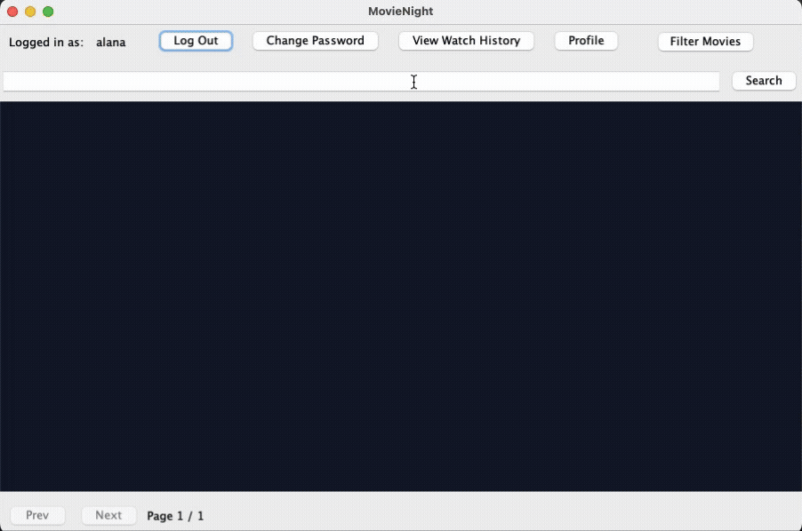
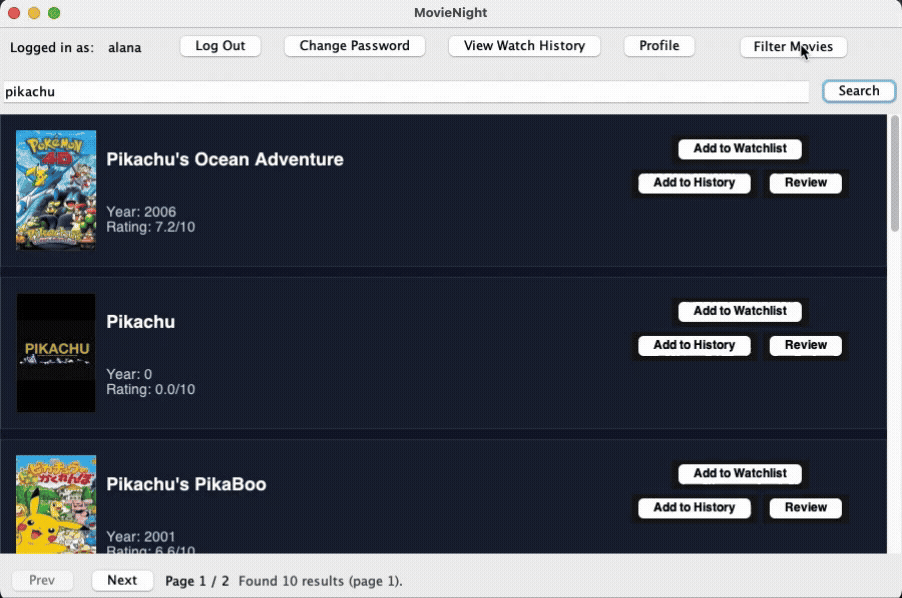
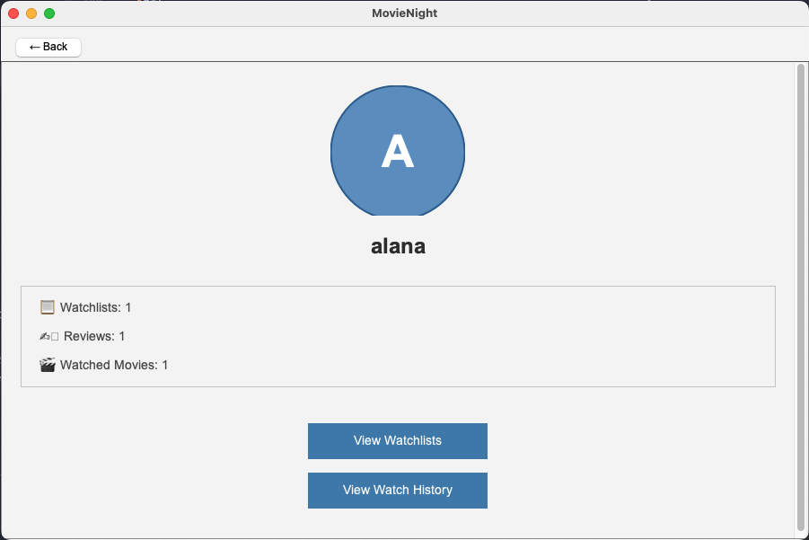
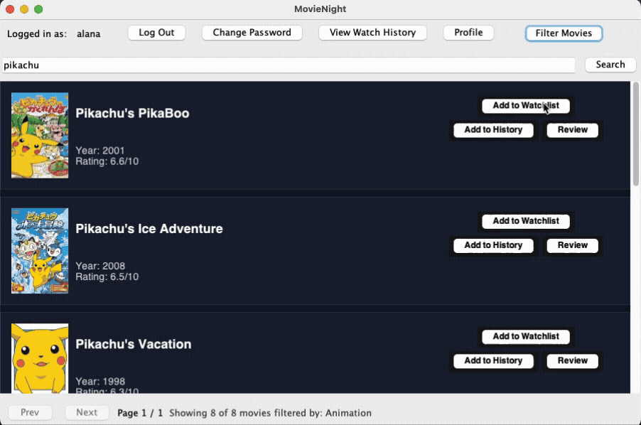
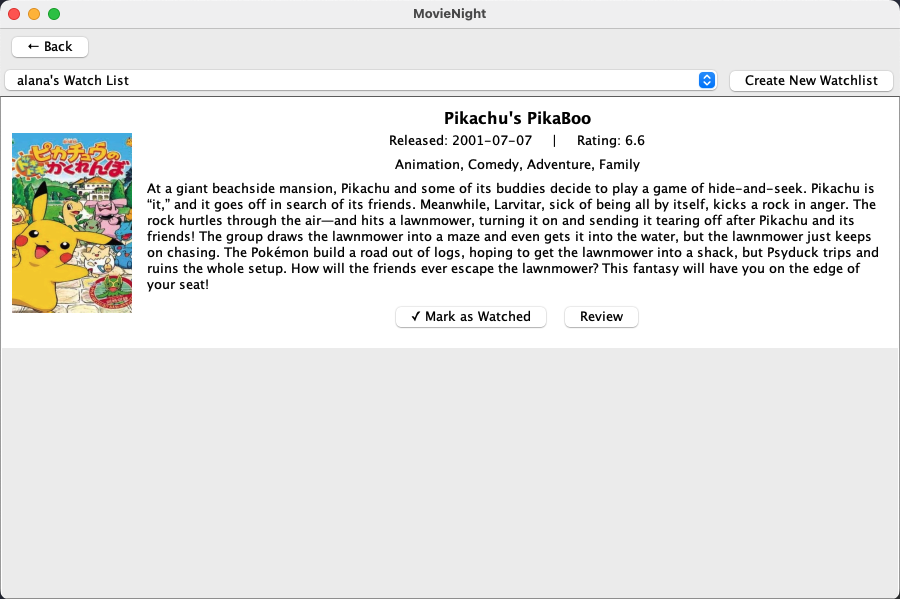
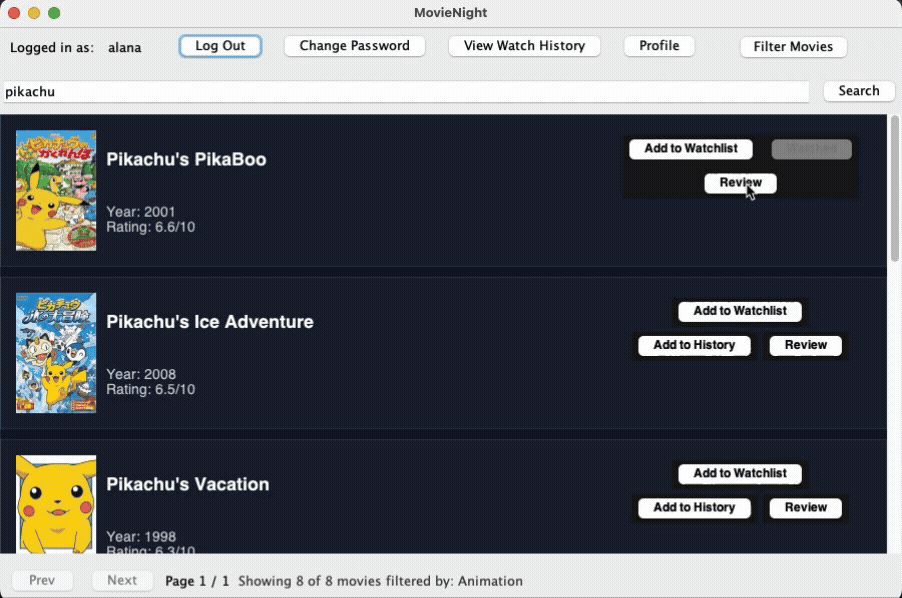
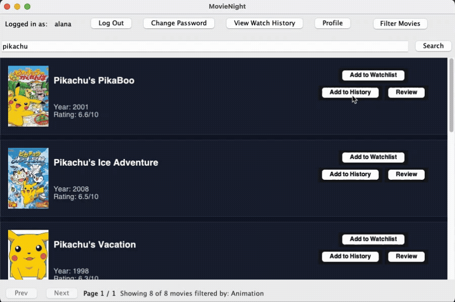
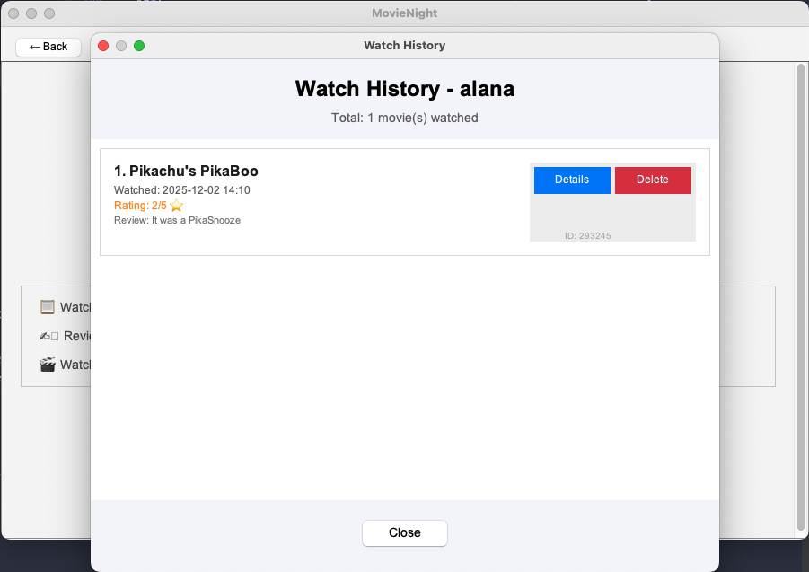

# MovieNight

### Software Design Project - CSC207 Fall 2025

**MovieNight** is a Java Swing desktop application that allows users to discover movies, organize WatchLists, 
track their viewing history, and rate and review movies.
The app retrieves live movie information from [The Movie Database (TMDb) API](https://developer.themoviedb.org/) and persists the data using a 
combination of an in-memory cache and JSON file storage.

MovieNight follows Clean Architecture and SOLID design principles.
Core logic is seperated from the UI, allowing for easy extension and maintaining.
Movie data is retrieved through a dedicated data access layer that communicates with TMDb using authenticated HTTP requests.

Users can search for movies by title, add to their WatchLists, store their viewing history, and rate or review movies. The Swing interface presents search results, watchlist tools, and movie information in a simple and interactive layout.

---

## Architecture Overview

MovieNight is structured using Clean Architecture:
- **Entities:** Core domain models (`User`, `Movie`, `WatchList`, `Review`, `WatchHistory`, etc.)
- **Use Cases:** Application-specific business logic implemented by interactors.
- **Interface Adapters:** Controllers, presenters, and view models.
- **Frameworks & Drivers:** Swing UI and data access layer

---

## Data Persistence Architecture

MovieNight includes a layered persistence system:
1. `FileUserDataAccessObject`
   - Saves and loads complete nested `User` objects to/from a JSON file.
2. `InMemoryUserDataAccessObject`
   - Provides fast caching for user data.
3. `CachedUserDataAccessObject`
   - Wraps both DAOs.
   - Reads use cache-first lookup.
   - Writes propagate to both in-memory and persistent storage.
   - Use cases depend only on the `UserDataAccessInterface`, allowing the storage backend to be easily swapped 
(JSON → database → remote API) without modifying buisness  logic.

---

## API Information

The app integrates [The Movie Database (TMDb) API](https://developer.themoviedb.org/) via the custom `TMDbMovieDataAccessObject`.

### End Points Used
#### Search movies by title
- GET https://api.themoviedb.org/3/search/movie
- Used in the search feature
- Returns movie summaries, poster paths, ratings, dates, and genre IDs

#### Get full movie details
- GET https://api.themoviedb.org/3/movie/{id}
- Used to fetch complete data for a selected movie
- Returns plot, genres, popularity, rating, release date, poster path, and more

### Authentication
- The application loads an API token from a `.env` file using the dotenv library.
- The file must contain:
  `APITOKENKEY=your_token_here`

### Interaction
- All TMDb interaction is handled by `TMDbMovieDataAccessObject`.
- It uses Java HttpClient to send requests and performs lightweight JSON parsing to extract movie fields, lists of genres, and pagination info.
---

## Team User Stories & Contributions
*(Alphabetical by developer)*

| Developer                               | User Story / Feature | Description                                                                                                                               |
|-----------------------------------------|----------------------|-------------------------------------------------------------------------------------------------------------------------------------------|
| **Alana Watson** @alana-watson      | **Add to My WatchList** | Add a movie from the search results to a chosen WatchList; includes popup confirmation and success feedback.                              |
|                                         | **View My WatchLists** | From the profile page, open a full WatchList view showing all movies the user has added.                                                  |
|                                         | **Data Persistence Layer** | Implemented the full persistence system (File DAO, In-Memory DAO, Cached Decorator). Enables complete JSON save/load of nested user data. |
| **Chester Zhao** @chesteryangzhao98 | **Search Movies by Title** | Queries TMDb for matching titles and displays interactive movie cards with posters and metadata.                                          |
| **Inba Thiyagarajan** @inba2000     | **Filter Movies by Genre** | Filters movie search results by selected genre(s). Also developed `GenreUtils` used throughout the UI.                                |
| **Jiaqi Zhao** @Romyzhao7777        | **Record Watch History** | Mark a movie as watched and add it to the user’s Watch History.                                                                           |
|                                         | **View Watch History** | Display all watched movies, accessible from the profile page.                                                                             |
|                                         | **Edit / Delete Watched Movies** | Modify or remove entries in the users’ Watch History.                                                                                     |
| **Oliver Bisbee** @oliverbisbee     | **Review Movies** | Create and save reviews for movies.                                                                                                       |
|                                         | **TMDb API Integration** | Built the Movie DAO and API gateway for the team.                                                                                         |
| **Rana Nagash** @rananagash                   | **View My Profile** | Displays user activity including WatchLists and Watch History.                                                                            |
|                                         | *(Setup Work)* Login / Logout / Signup / Change Password | Integrated and refactored the starter code use cases to match project architecture.                                                       |

---

## Feature Demonstrations

### Search for Movies by Title

### Filter Movies by Genre

### View my Profile

### Add & View my WatchLists

### Rate & Review Movies

### Record & View Watch History

---

## Testing

Includes:
- Unit tests for entity classes
- Tests for each use case interactor
- Tests varifying JSON persistence

---

## Future Enhancements
A list of Use Cases that we explored but did not implement, but would have liked to given more time. 
By adhering to CA and SOLID principles, these could be implemented with minimal work.

### Movie Exploration
- Detailed movie information view (Search results → click poster → movie details)
- Sort search results (name, rating, year, popularity, etc.)
- Advanced filtering (multiple attribute-filtering, date ranges, runtime)

### WatchLists
- Create and name additional WatchLists
- Delete movies from WatchList
- Delete WatchLists
- Reorder WatchList contents

### Reviews & Ratings
- Review collections (Favourites, Top 10, Best new genre, etc.)
- Delete Reviews

### Social Features
- Friends
- Shared WatchLists
- Compare WatchLists with friends to find shared movies (intersection)
- MovieNight Scheduling feature

### UI & Accessibility
- Dark/Light theme switching
- Improved navigation support
- Other accessibility improvements

---

## Team
- Alana Watson - @alana-watson
- Chester Zhao - @chesteryangzhao98
- Inba Thiyagarajan - @inba2000
- Jiaqi Zhao - @Romyzhao7777
- Oliver Bisbee - @oliverbisbee
- Rana Nagash - @rananagash